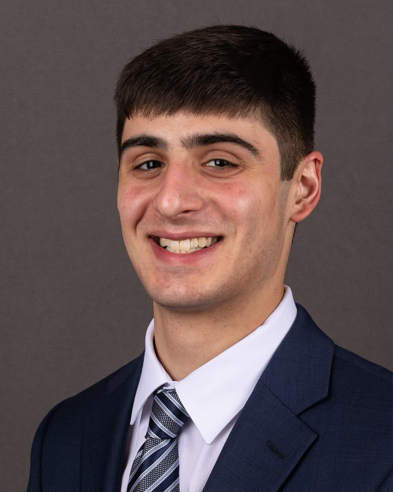

# Hi there, I'm Giovanni Lunetta 👋

I'm a graduate student at the University of Connecticut, where I'm currently pursuing a Master's degree in Data Science. Having graduated in 2023 from UConn, I hold a major in Statistics and Political Science along with a minor in Mathematics.

## About Me 🌐

- 🔭 I'm passionate about **Healthcare** and **Sports**
- 🎓 **Majors:** Statistics, Political Science
- 📚 **Minor:** Mathematics
- 🏫 **Alma Mater:** University of Connecticut (UConn), 2023 Graduate
- 🎯 **Interests:** Applying data science techniques in healthcare and sports analytics

## Connect with Me 📬

Feel free to visit [my overall GitHub page](https://github.com/giovanni-lunetta/) to explore my projects and get to know more about my work.

If you'd like to reach out, you can connect with me on [LinkedIn](https://www.linkedin.com/in/giovanni-lunetta/), or send me an email at glunetta02@gmail.com.

---

Thank you for visiting my profile, and have a great day!
